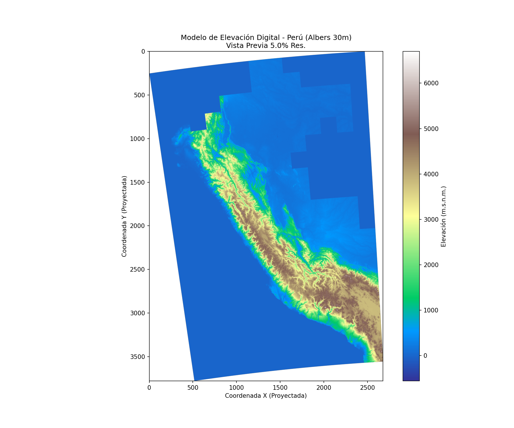

# Predictive Model for Archaeological Potential in Peru

**Modelo predictivo de potencial arqueológico basado en Machine Learning y datos geoespaciales.**

Proyecto de investigación que combina teledetección, sistemas de información geográfica (GIS) y aprendizaje supervisado para estimar la probabilidad de presencia de restos arqueológicos a una resolución de 30×30 metros sobre el territorio peruano.



---

## Overview

Este sistema entrena un clasificador binario (Random Forest / XGBoost) utilizando variables ambientales y culturales derivadas de un Modelo Digital de Elevación (ASTER GDEM, 30m) y registros oficiales del Ministerio de Cultura del Perú.

El modelo identifica patrones geográficos asociados a asentamientos prehispánicos y genera mapas de probabilidad arqueológica para regiones de interés.

### Resultados actuales (v1 — línea base)

| Modelo | Accuracy | AUC-ROC | F1-Score |
|--------|:--------:|:-------:|:--------:|
| Random Forest | 0.91 | 0.970 | 0.92 |
| XGBoost | 0.90 | 0.965 | 0.91 |
| Logistic Regression | 0.81 | 0.899 | 0.84 |

> **Nota:** La v1 presenta autocorrelación espacial (82.9% del peso predictivo proviene de variables de proximidad a sitios conocidos). La v2 incorporará variables ambientales derivadas del DEM para reducir esta dependencia.

---

## Project Structure

```
arqueologia-predictiva/
│
├── data/
│   ├── raw/                        # Datos crudos sin modificar
│   │   ├── dem_tiles/              # Tiles ASTER GDEM (272 cuadrantes)
│   │   └── sitiosarqueologicos/    # Shapefiles del Ministerio de Cultura
│   │       ├── declarados/
│   │       ├── delimitados/
│   │       └── qhapaqnan/
│   ├── processed/
│   │   ├── rasters/                # Rasters alineados (CRS: ESRI:102033, 30m)
│   │   └── samples/                # Muestras de presencia/ausencia
│   └── features/                   # Dataset de entrenamiento final
│
├── notebooks/
│   ├── 01_Data_Extraction_and_Preprocessing.ipynb
│   ├── 02_Training_and_Model_Validation.ipynb
│   ├── 03_Prediction_and_Mapping.ipynb
│   └── 04_MultiRegion_Prediction.ipynb
│
├── src/
│   ├── preprocessing/              # Pipeline de procesamiento geoespacial
│   │   ├── download_dem.py
│   │   ├── merge_and_reproject_dem.py
│   │   ├── merge_tiles.py
│   │   └── compute_terrain_derivatives.py
│   └── utils/                      # Herramientas auxiliares
│       ├── check_whitebox.py
│       ├── inspect_shapefile.py
│       └── visualize_dem.py
│
├── models/                         # Modelos serializados (.pkl)
├── outputs/
│   ├── figures/                    # Visualizaciones y gráficos
│   └── predictions/                # Mapas de probabilidad (.tif)
├── docs/                           # Documentación técnica
├── requirements.txt
└── README.md
```

---

## Variables

### v1 (actual)

| Variable | Tipo | Fuente |
|----------|------|--------|
| Pendiente (°) | Topográfica | DEM ASTER 30m |
| Rugosidad (TRI) | Topográfica | DEM ASTER 30m |
| Distancia a ríos (m) | Hidrológica | ANA / HydroSHEDS |
| Distancia a lagos (m) | Hidrológica | ANA / HydroSHEDS |
| Distancia al Qhapaq Ñan (m) | Cultural | Ministerio de Cultura |
| Distancia a sitios G1/G2/G3 (m) | Cultural | Ministerio de Cultura |

### v2 (en desarrollo)

Altitud, pisos ecológicos, aspecto solar, curvatura, TPI, TWI, ecotonos, confluencias, litología.

---

## Reproducibility

### Requirements

```
Python >= 3.10
GDAL >= 3.4
```

### Setup

```bash
git clone https://github.com/<usuario>/arqueologia-predictiva.git
cd arqueologia-predictiva
python -m venv venv
source venv/bin/activate
pip install -r requirements.txt
```

### Execution order

1. **Notebook 01** — Extracción de datos y preprocesamiento (pixel drilling)
2. **Notebook 02** — Entrenamiento, validación y selección de modelos
3. **Notebook 03** — Predicción y generación de mapas de probabilidad
4. **Notebook 04** — Predicción multiregional (Cusco, Arequipa, Lima, Nazca, Puno)

> Los datos crudos (tiles DEM, shapefiles) no se incluyen en el repositorio por peso. Consultar las fuentes en la sección de datos.

---

## Data Sources

| Dataset | Fuente | Acceso |
|---------|--------|--------|
| ASTER GDEM v3 (30m) | NASA / METI | [EarthData](https://search.earthdata.nasa.gov/) |
| Sitios arqueológicos declarados | Ministerio de Cultura del Perú | [SIGDA](https://sigda.cultura.gob.pe/) |
| Sitios arqueológicos delimitados | Ministerio de Cultura del Perú | SIGDA |
| Qhapaq Ñan (red vial inca) | Ministerio de Cultura del Perú | SIGDA |
| Red hídrica | Autoridad Nacional del Agua (ANA) | [ANA GeoPortal](https://www.ana.gob.pe/) |

---

## Technical Specifications

- **CRS:** South America Albers Equal Area Conic (ESRI:102033)
- **Spatial resolution:** 30 × 30 meters
- **Training samples:** ~27,000 (balanced presence/absence)
- **Algorithms:** Random Forest, XGBoost, Logistic Regression (scikit-learn, xgboost)
- **Validation:** Stratified 70/30 train-test split

---

## Author

**Yishar Piero Nieto Barrientos**

---

## License

This project is for research purposes. All archaeological data belongs to the Ministry of Culture of Peru.